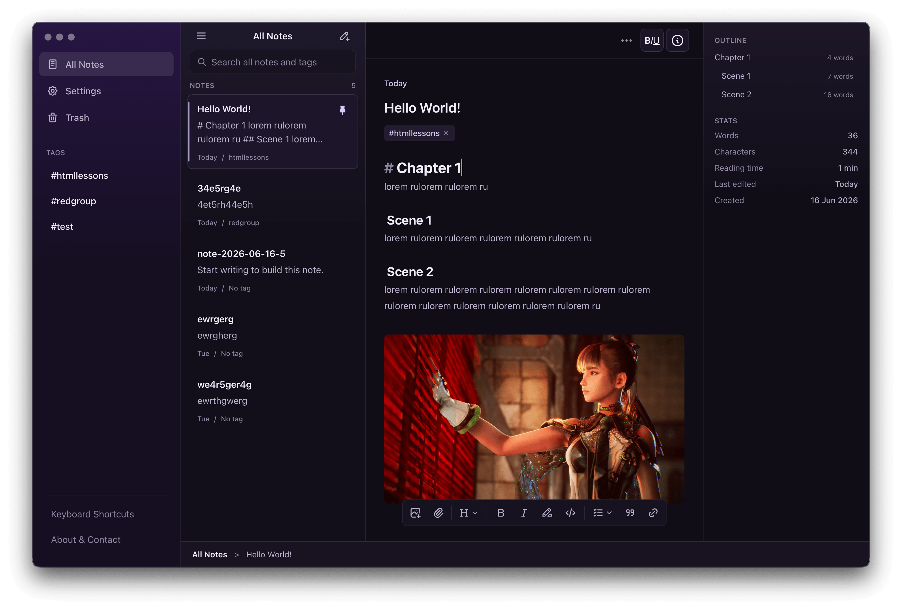

<div align="center">


# Tinta

**A desktop-first, privacy-first writing app for long-form drafts.**

Your texts stay on your device. No accounts. No cloud. No tracking.

<br />

A notes app by **Max** &nbsp;·&nbsp; [**RED GROUP**](https://www.youtube.com/redgroup) &nbsp;×&nbsp; [**htmllessons.io**](https://htmllessons.io)

<a href="https://www.youtube.com/redgroup"></a>
&nbsp;&nbsp;
<a href="https://t.me/redgroup"></a>

<br />



<br />
<br />

🎬 **Watch how this project was built:** [How I built Tinta on YouTube](https://www.youtube.com/watch?v=jmxHrd6wad4)

</div>

---

> [!IMPORTANT] Tinta is **source-available**, not open source. It is free for
> personal, educational, and other **non-commercial** use. **Commercial use
> requires a separate license.** See [License](#license).

## What it is

Tinta is a calm, native-feeling **desktop** editor built for **long-form
writing** — chapters, scripts, essays, drafts. Notes are plain **Markdown
files** in a folder you choose: readable, portable, and yours, with no lock-in.

It's made for people who write a lot in one place and want to stay oriented in a
big document, track their progress, and keep everything private and on-device.

- **Local & private** — everything lives on disk; no accounts, no sync, no
  telemetry.
- **Built for long documents** — fast and responsive even on large drafts.
- **You own your files** — Markdown in a folder you pick yourself.

## Features

### 📑 Outline & navigation

Tinta builds a live **table of contents** from your headings, so you can see the
shape of a long document and jump between sections instantly. Each section shows
its own size at a glance:

```
Intro        — 420 words
Chapter 1    — 2,800 words
Chapter 2    — 240 words
Conclusion   — 90 words
```

### 📊 Writing stats

Always-on stats for the current document:

```
Words:        4,820
Characters:   27,300
Reading time: 24 min
Last edited:  today
Created:      …
```

Reading time isn't a generic guess — it uses a **personal speed multiplier** so
the estimate matches _your_ actual pace.

### ✨ Smart templates

Ready-made, structured templates to start fast — e.g. a **script/screenplay**
layout and other long-form formats — so you skip the blank-page setup.

### ⌨️ Editing built for speed

- **Markdown** writing with a clean, focused editor.
- **Super-usable keyboard shortcuts** for editing and formatting — hands stay on
  the keyboard.
- **Autosave** — your work is written to disk as you type; nothing to remember.

### 📤 Export

Export your draft to **PDF**, **TXT**, or **Markdown (.md)**.

### 🎨 Themes & storage

- **Light & dark** themes — a premium violet "ink" palette.
- **Pick your own folder** for where notes are stored.

## Downloads

Release builds (Windows `.exe`, macOS `.dmg`, Linux AppImage / `.deb`) are
published on the [Releases](../../releases) page.

## License

Tinta is licensed under the [PolyForm Noncommercial License 1.0.0](./LICENSE).

- ✅ **Free** for personal, educational, research, and non-commercial use.
- 💼 **Commercial use requires a separate license** — see
  [`COMMERCIAL-LICENSE.md`](./COMMERCIAL-LICENSE.md).
- ™️ The **Tinta** name, logo, and icons are **not** covered by the code license
  — see [`TRADEMARKS.md`](./TRADEMARKS.md).

Security reports: see [`SECURITY.md`](./SECURITY.md).
